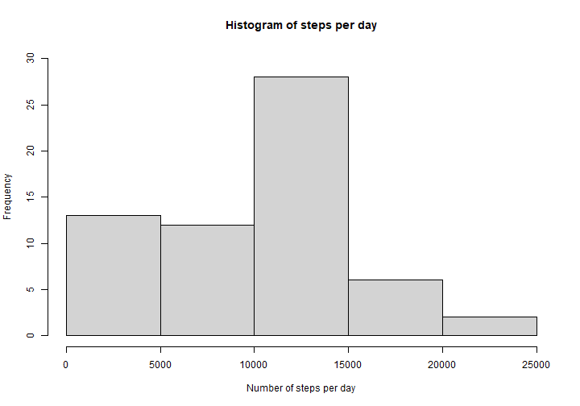
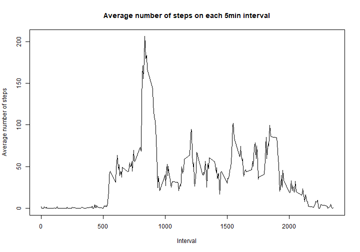
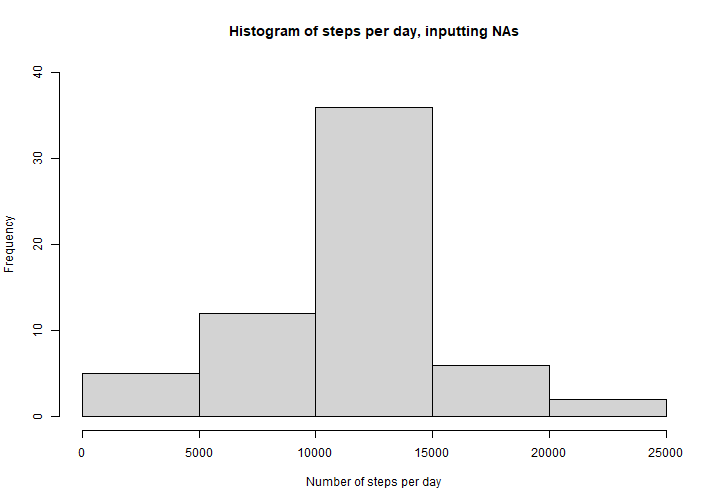
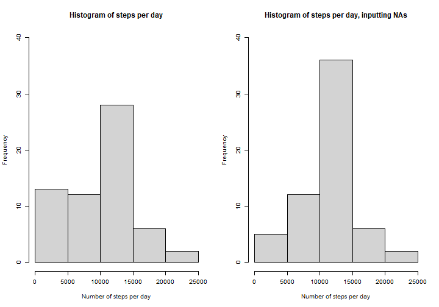
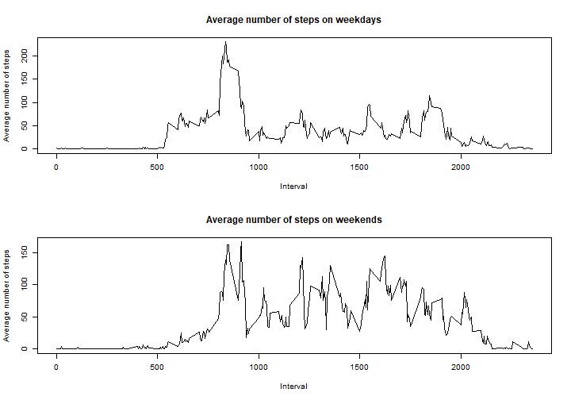

## Loading and preprocessing the data

First let's unzip the data and load it into R:


```r
unzip("activity.zip")
activity <- read.csv("activity.csv")
```

Now let's have a first look:


```r
dim(activity)
```

```
## [1] 17568     3
```

```r
head(activity)
```

```
##   steps       date interval
## 1    NA 2012-10-01        0
## 2    NA 2012-10-01        5
## 3    NA 2012-10-01       10
## 4    NA 2012-10-01       15
## 5    NA 2012-10-01       20
## 6    NA 2012-10-01       25
```
The data was loaded successfully, with the expected number of rows and columns. We just need to convert the date column from char to a Date format:


```r
activity$date <- as.Date(activity$date, format = "%Y-%m-%d")
head(activity)
```

```
##   steps       date interval
## 1    NA 2012-10-01        0
## 2    NA 2012-10-01        5
## 3    NA 2012-10-01       10
## 4    NA 2012-10-01       15
## 5    NA 2012-10-01       20
## 6    NA 2012-10-01       25
```

## What is mean total number of steps taken per day?

Following the project instructions, we will ignore the missing values in the dataset for this step. Let's use the group_by and summarize functions from the dplyr library to calculate the total number of steps taken per day:


```r
library(dplyr)

stepsday <- activity %>% group_by(date) %>% summarize(steps = sum(steps, na.rm=TRUE))
head(stepsday)
```

```
## # A tibble: 6 × 2
##   date       steps
##   <date>     <int>
## 1 2012-10-01     0
## 2 2012-10-02   126
## 3 2012-10-03 11352
## 4 2012-10-04 12116
## 5 2012-10-05 13294
## 6 2012-10-06 15420
```

Now let's make  histogram of the total number of steps taken each day:


```r
hist(stepsday$steps, main = "Histogram of steps per day", ylim=c(0, 30), xlab = "Number of steps per day")
```



We can see that the most frequent range of steps taken per day is between 10,000 and 15,000.

Let's calculate also the mean and median total number of steps taken per day:

```r
meansteps <- mean(stepsday$steps)
meansteps
```

```
## [1] 9354.23
```

```r
mediansteps = median(stepsday$steps)
mediansteps
```

```
## [1] 10395
```
So the mean total number of steps per day is approximately 9354 and the median per day is 10395.

## What is the average daily activity pattern?

Let's make a time series plot of the average number of steps taken on each 5-minute interval (x-axis) across all days (y-axis), using once again the group_by and summarize functions from the dplyr library:


```r
mean5min <- activity %>% group_by(interval) %>% summarize(steps = mean(steps, na.rm=TRUE))
plot(mean5min$interval, mean5min$steps, type="l", main="Average number of steps on each 5min interval", xlab="Interval", ylab="Average number of steps")
```



We can find out the 5min interval that contains the maximum number of steps, on average across all days, by subsetting the dataframe as follows:


```r
max5min <- mean5min[mean5min$steps == max(mean5min$steps, na.rm=TRUE), ]
max5min
```

```
## # A tibble: 1 × 2
##   interval steps
##      <int> <dbl>
## 1      835  206.
```
Therefore, the 5min interval that contains the maximum number of steps, on average across all days, is 835, with approximately 206 steps.

## Imputing missing values

First, let's check how many NAs we have in each column:


```r
sum(is.na(activity$steps))
```

```
## [1] 2304
```

```r
sum(is.na(activity$date))
```

```
## [1] 0
```

```r
sum(is.na(activity$interval))
```

```
## [1] 0
```
We can see that only the steps column has missing values; therefore the number of rows with missing values will be the same as the number of missing values in this column (2304).

Now let's create a new dataset with values filled in the missing values. For each missing value, we will input the average number of steps for that 5-minute interval:


```r
activityfill <- activity
for(i in 1:length(activity$steps)){
    if(is.na(activityfill[i, 1])){
        activityfill[i, 1] <- mean5min[activityfill[i, 3] == mean5min$interval,2]
    }
}
```
Now let's make a histogram of the total number of steps taken each day and calculate the mean and median total number of steps taken per day, just like we did before inputting data in the missing values:


```r
stepsdayfill <- activityfill %>% group_by(date) %>% summarize(steps = sum(steps, na.rm=TRUE))

hist(stepsdayfill$steps, main = "Histogram of steps per day, inputting NAs", ylim=c(0, 40), xlab = "Number of steps per day")
```



```r
meanstepsfill <- mean(stepsdayfill$steps)
meanstepsfill
```

```
## [1] 10766.19
```

```r
medianstepsfill = median(stepsdayfill$steps)
medianstepsfill
```

```
## [1] 10766.19
```
To facilitate the analysis, let's plot the two histograms side by side:

```r
par(mfrow = c(1, 2), cex = 0.8)
hist(stepsday$steps, main = "Histogram of steps per day", ylim=c(0, 40), xlab = "Number of steps per day")
hist(stepsdayfill$steps, main = "Histogram of steps per day, inputting NAs", ylim=c(0, 40), xlab = "Number of steps per day")
```



We can see that the frequency of the range between 0 and 5,000 steps decreased, while the frequency of the range between 10,000 and 15,000 steps increased. The other ranges didn't have  big changes.

Let's compare now the mean and the median before and after inputting the missing values:

|Steps|Excluding NAs|Inputting missing values|
|:----:|:----:|:----:|
|mean |9354.23| 10766.19 |
|median|10395 | 10766.19|

We can see that both the mean and the median increased after we inputted the missing values. Additionally, the mean and median values after inputting the missing values are the same.

## Are there differences in activity patterns between weekdays and weekends?

Lets add a column weekday in the dataset to indicate if a given date is a weekday or a weekend:


```r
# create dayofweek column with values between 1 (Monday) and 7 (Sunday) 
activityweek <- activityfill %>% mutate(dayofweek = format(date, "%u"))

#convert dayofweek column to factor weekday or weekend
for(i in 1:length(activityweek$date)){
    if(activityweek$dayofweek[i]<=5){
        activityweek$dayofweek[i]="weekday"
    }
    else{
        activityweek$dayofweek[i]="weekend"
    }
}

activityweek$dayofweek = factor(activityweek$dayofweek)
head(activityweek)
```

```
##       steps       date interval dayofweek
## 1 1.7169811 2012-10-01        0   weekday
## 2 0.3396226 2012-10-01        5   weekday
## 3 0.1320755 2012-10-01       10   weekday
## 4 0.1509434 2012-10-01       15   weekday
## 5 0.0754717 2012-10-01       20   weekday
## 6 2.0943396 2012-10-01       25   weekday
```

Now we'll make a panel plot containing a time series plot of the 5-minute interval (x-axis) and the average number of steps taken, averaged across all weekday days or weekend days.


```r
stepsweek <- activityweek %>% group_by(dayofweek, interval) %>% summarize(steps = mean(steps))
```

```
## `summarise()` has grouped output by 'dayofweek'. You can override using the `.groups` argument.
```

```r
par(mfrow = c(2, 1), cex = 0.8)
with(subset(stepsweek, dayofweek=="weekday"), plot(interval, steps, type="l", main="Average number of steps on weekdays", xlab="Interval", ylab="Average number of steps"))
with(subset(stepsweek, dayofweek=="weekend"), plot(interval, steps, type="l", main="Average number of steps on weekends", xlab="Interval", ylab="Average number of steps"))
```



We can see that on weekdays, the average number of steps is higher in the morning, around 8 or 9am, with the rest of the day having much lower averages. On weekends, on the other hand, there isn't such an isolated peak of high average steps as in the weekdays, it is more distributed between around 8am and 8pm.


